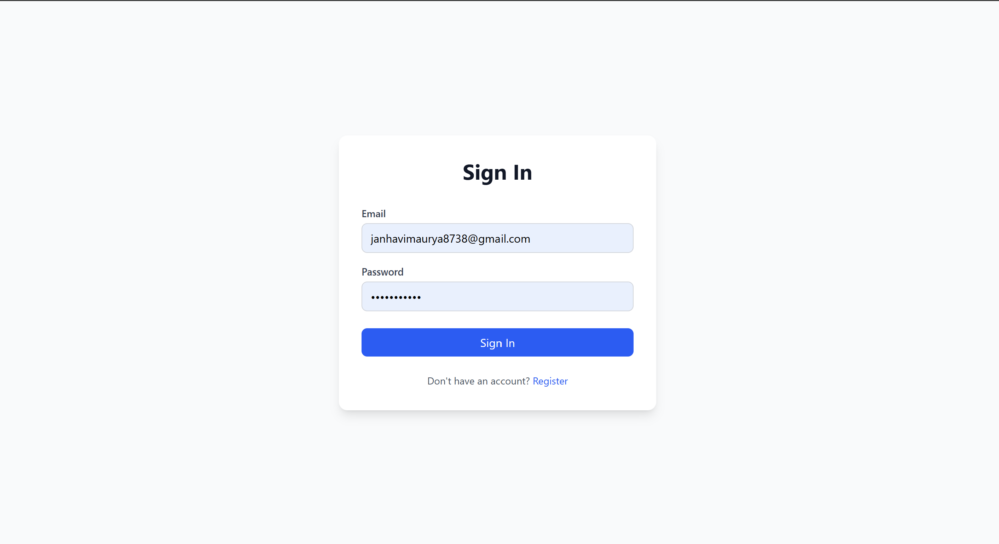
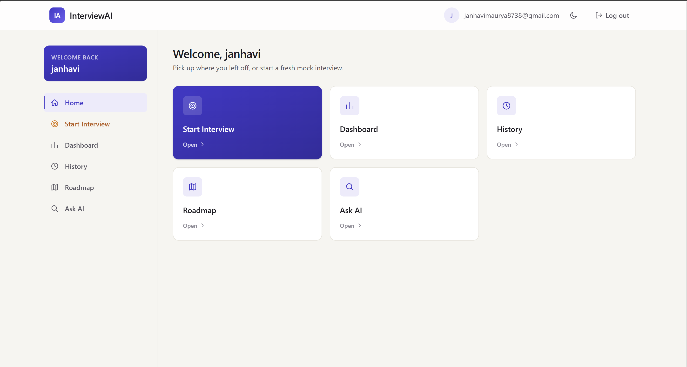
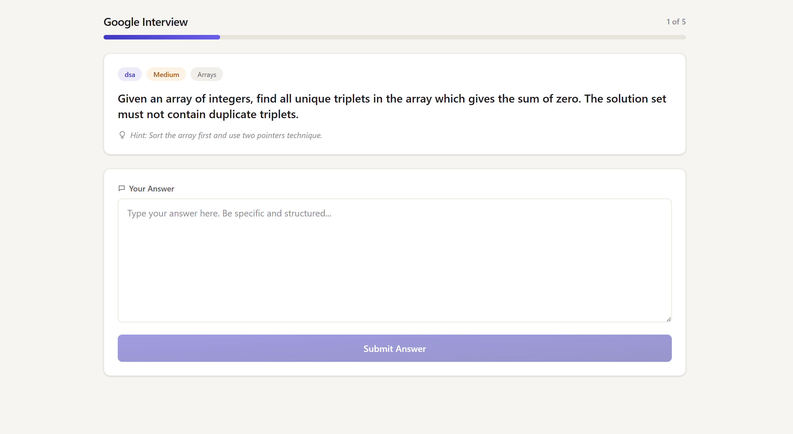
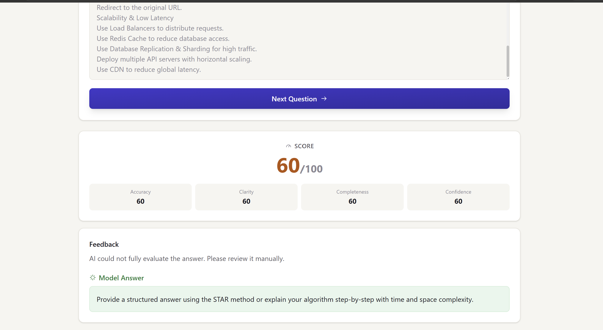

# 🚀 Interview Trainer AI

> **An AI-Powered Interview Preparation Platform built using IBM watsonx.ai (Granite Foundation Models), FastAPI, React.js, ChromaDB (RAG), and MongoDB Atlas.**

<p align="center">


</p>

---

# 📖 Overview

**Interview Trainer AI** is an intelligent **Agentic AI-powered interview preparation platform** that helps students and professionals prepare for technical and HR interviews through personalized question generation, AI-based answer evaluation, Retrieval-Augmented Generation (RAG), and customized learning roadmaps.

The platform leverages **IBM watsonx.ai Granite Foundation Models** along with a **multi-agent architecture** to simulate a real interview experience. It understands the user's profile, generates company-specific interview questions, evaluates responses using AI, identifies weak areas, and recommends personalized study plans for continuous improvement.

By combining **Retrieval-Augmented Generation (RAG)** with **ChromaDB**, the system retrieves verified interview knowledge instead of relying only on LLM memory, significantly reducing hallucinations and improving response accuracy.

---

# 🎯 Key Objectives

- Generate personalized interview questions based on:
  - Job Role
  - Experience Level
  - Target Company
  - Interview Category

- Evaluate interview answers using AI

- Provide detailed strengths & weaknesses analysis

- Generate personalized learning roadmaps

- Retrieve verified interview knowledge using RAG

- Visualize interview performance using analytics dashboards

---

# ✨ Features

| Feature | Description |
|----------|-------------|
| 🤖 **AI Interview Questions** | Generate personalized interview questions using IBM Granite Foundation Models. |
| 🧠 **RAG Knowledge Retrieval** | Retrieve verified interview knowledge using ChromaDB to improve response accuracy. |
| 🎯 **Company-Specific Preparation** | Practice interviews for Google, Amazon, Microsoft, Infosys, TCS, and more. |
| 📊 **AI Answer Evaluation** | Evaluate answers based on Accuracy, Clarity, Completeness, and Confidence. |
| 📈 **Performance Dashboard** | Interactive analytics showing interview performance, strengths, and improvement trends. |
| 🛣️ **Learning Roadmap** | AI-generated personalized learning plans based on interview performance. |
| 🔒 **Secure Authentication** | JWT-based authentication with encrypted password storage using Bcrypt. |
| 📝 **Interview History** | Save interview sessions and review previous performance anytime. |
| 🌙 **Modern Responsive UI** | Responsive React interface supporting desktop, tablet, and mobile devices. |
| ☁️ **Cloud Deployment** | Backend deployed on Render and frontend hosted on Vercel. |

---

# 🌟 Why Interview Trainer AI?

Traditional interview preparation platforms generally provide static questions and generic feedback. Interview Trainer AI goes beyond that by combining **Large Language Models**, **Agentic AI**, and **Retrieval-Augmented Generation (RAG)** to deliver an adaptive, personalized, and intelligent interview preparation experience.

The platform acts as a virtual AI interview coach that continuously learns from user performance and provides actionable recommendations for improvement.

---


# 📸 Project Preview

> *(Replace these placeholders with your project screenshots after deployment.)*

- Login Page
- Dashboard
- AI Interview Generator
- Answer Evaluation
- Performance Dashboard
- Personalized Learning Roadmap

---
# 🏗️ System Architecture

```text
                        ┌──────────────────────────────┐
                        │         User (Browser)        │
                        └──────────────┬───────────────┘
                                       │
                                       ▼
                        ┌──────────────────────────────┐
                        │      React + Vite Frontend    │
                        │        (Hosted on Vercel)     │
                        └──────────────┬───────────────┘
                                       │ REST APIs
                                       ▼
                        ┌──────────────────────────────┐
                        │      FastAPI Backend          │
                        │      (Hosted on Render)       │
                        └──────────────┬───────────────┘
                                       │
              ┌────────────────────────┼────────────────────────┐
              ▼                        ▼                        ▼
      MongoDB Atlas           IBM watsonx.ai              ChromaDB
   (Users & History)       Granite Foundation       (Vector Database)
                                Models                    │
                                                         ▼
                                            Knowledge Base (RAG)
```

---

# 🤖 Multi-Agent Architecture

Interview Trainer AI follows an **Agentic AI architecture**, where multiple intelligent agents collaborate to provide a personalized interview preparation experience.

| Agent | Responsibility |
|--------|---------------|
| 🎯 **Question Generation Agent** | Generates personalized interview questions based on role, company, and experience level. |
| 📚 **Knowledge Retrieval Agent** | Retrieves relevant interview knowledge using ChromaDB and RAG. |
| 🧠 **Answer Evaluation Agent** | Evaluates candidate answers using IBM Granite Foundation Models. |
| 📈 **Learning Roadmap Agent** | Identifies weak areas and creates personalized study plans. |
| 📊 **Performance Analytics Agent** | Tracks interview history, scores, and progress using analytics dashboards. |

---

# 🧠 Retrieval-Augmented Generation (RAG) Workflow

Instead of relying solely on Large Language Models, the application combines **IBM Granite Models** with **ChromaDB** to retrieve verified interview knowledge before generating responses.

```text
User Question
      │
      ▼
Retrieve Relevant Knowledge
      │
      ▼
ChromaDB Vector Search
      │
      ▼
Relevant Context Retrieved
      │
      ▼
IBM Granite Foundation Model
      │
      ▼
Context-Aware AI Response
```

### Advantages of RAG

- Reduces hallucinations
- Improves answer accuracy
- Uses verified interview knowledge
- Company-specific context retrieval
- Better response quality

---

# ⚙️ Technology Stack

## 🤖 AI & Large Language Models

- IBM watsonx.ai
- IBM Granite Foundation Models
- Retrieval-Augmented Generation (RAG)

---

## 📚 Vector Database

- ChromaDB
- Semantic Search
- Persistent Vector Storage

---

## ⚙️ Backend

- FastAPI
- Python
- MongoDB Atlas
- JWT Authentication
- Passlib (Bcrypt)
- Pydantic

---

## 💻 Frontend

- React.js
- Vite
- Tailwind CSS
- React Router DOM
- Axios
- Recharts

---

## ☁️ Cloud & Deployment

- Render (Backend)
- Vercel (Frontend)
- Docker
- IBM Cloud Object Storage
- GitHub

---

# 📂 Project Structure

```text
Interview-Trainer-AI
│
├── backend/
│   ├── app/
│   │   ├── api/
│   │   ├── core/
│   │   ├── models/
│   │   ├── schemas/
│   │   ├── services/
│   │   └── main.py
│   │
│   ├── data/
│   │   └── knowledge_base/
│   │
│   ├── requirements.txt
│   ├── Dockerfile
│   └── start.sh
│
├── frontend/
│   ├── src/
│   │   ├── assets/
│   │   ├── components/
│   │   ├── context/
│   │   ├── hooks/
│   │   ├── pages/
│   │   ├── services/
│   │   └── App.jsx
│   │
│   ├── package.json
│   └── vite.config.js
│
└── README.md
```

---

# 🔄 Complete Application Workflow

```text
User Login
      │
      ▼
Authentication (JWT)
      │
      ▼
Dashboard
      │
      ▼
Generate Interview Questions
      │
      ▼
Retrieve Knowledge (RAG)
      │
      ▼
IBM Granite AI
      │
      ▼
Interview Questions
      │
      ▼
User Answers
      │
      ▼
AI Evaluation
      │
      ▼
Performance Analytics
      │
      ▼
Learning Roadmap
```

---

# 📌 Design Principles

- Modular Architecture
- Secure Authentication
- Scalable REST APIs
- AI-Driven Decision Making
- Context-Aware Responses
- Cloud-Native Deployment
- Responsive User Interface
- Retrieval-Augmented Generation (RAG)

# 🚀 Getting Started

Follow the steps below to set up and run the Interview Trainer AI project locally.

---

# 📋 Prerequisites

Before running the project, make sure you have the following installed:

- Python 3.11+
- Node.js 18+
- npm or yarn
- Git
- MongoDB Atlas Account
- IBM Cloud Account
- IBM watsonx.ai Project
- Docker (Optional)

---

# 📥 Clone the Repository

```bash
git clone https://github.com/janhavi-2011/Interview-Trainer-AI.git

cd Interview-Trainer-AI
```

---

# ⚙️ Backend Setup

Navigate to the backend folder:

```bash
cd backend
```

### Create Virtual Environment

#### Windows

```bash
python -m venv venv

venv\Scripts\activate
```

#### Linux / macOS

```bash
python3 -m venv venv

source venv/bin/activate
```

---

### Install Dependencies

```bash
pip install -r requirements.txt
```

---

# 🔑 Environment Variables

Create a `.env` file inside the backend directory.

```env
# IBM watsonx.ai

WX_API_KEY=YOUR_API_KEY

WX_URL=https://us-south.ml.cloud.ibm.com

WX_PROJECT_ID=YOUR_PROJECT_ID

# IBM Cloud Object Storage

COS_ACCESS_KEY=YOUR_ACCESS_KEY

COS_SECRET_KEY=YOUR_SECRET_KEY

COS_BUCKET_NAME=YOUR_BUCKET

COS_REGION=us-south

COS_ENDPOINT=YOUR_ENDPOINT

COS_INSTANCE_ID=YOUR_INSTANCE_ID

# MongoDB Atlas

MONGODB_URI=YOUR_MONGODB_URI

# JWT

JWT_SECRET=YOUR_SECRET_KEY

JWT_ALGORITHM=HS256

JWT_EXPIRY_MINUTES=60

# Application

APP_ENV=development

CORS_ORIGIN=http://localhost:5173
```

---

# 🧠 Load Knowledge Base

Before running the backend, load the interview knowledge into ChromaDB.

```bash
python load_knowledge_base.py
```

Successful output:

```text
✅ Knowledge base loading complete!
```

---

# ▶️ Run Backend

```bash
uvicorn app.main:app --reload --port 8000
```

Backend API:

```
http://localhost:8000
```

Swagger Documentation:

```
http://localhost:8000/docs
```

---

# 💻 Frontend Setup

Open a new terminal.

Navigate to frontend:

```bash
cd frontend
```

---

### Install Packages

```bash
npm install
```

---

### Frontend Environment Variable

Create a `.env` file.

```env
VITE_API_URL=http://localhost:8000
```

---

### Start Frontend

```bash
npm run dev
```

Frontend URL

```
http://localhost:5173
```

---

# 🐳 Docker Setup (Optional)

Build Docker Image

```bash
docker build -t interview-trainer-ai .
```

Run Container

```bash
docker run -p 8000:8000 interview-trainer-ai
```

---

# ☁️ Deployment

## Backend

- Render
- Docker
- FastAPI

Backend URL

```
https://interview-trainer-ai.onrender.com
```

Swagger Docs

```
https://interview-trainer-ai.onrender.com/docs
```

---

## Frontend

Hosted on Vercel

Frontend URL

```
https://interview-trainer-ai-three.vercel.app
```

---

# 🔗 Backend Integration

Update frontend environment variable before deployment.

```env
VITE_API_URL=https://interview-trainer-ai.onrender.com
```

---

# 🛠 Troubleshooting

| Issue | Solution |
|--------|----------|
| MongoDB connection failed | Verify MongoDB URI |
| IBM Authentication Error | Verify API Key & Project ID |
| ChromaDB not loading | Run `python load_knowledge_base.py` |
| Backend not starting | Install all dependencies using `requirements.txt` |
| Swagger not opening | Ensure FastAPI server is running |
| Frontend API Error | Verify `VITE_API_URL` |
| Login/Register returns 404 | Check backend URL and `/api` routes |
| CORS Error | Update `CORS_ORIGIN` in backend |

---

# 🔐 Security Features

- JWT Authentication
- Password Hashing (Bcrypt)
- Protected Routes
- Secure API Access
- Environment Variable Management
- MongoDB Atlas Cloud Security

---

# 📈 Performance Optimizations

- Retrieval-Augmented Generation (RAG)
- Persistent ChromaDB Vector Store
- Async FastAPI APIs
- Optimized MongoDB Queries
- Axios API Interceptors
- Responsive React Components
- Lazy Loading
- Dockerized Deployment
# 🌐 REST API Documentation

The backend exposes RESTful APIs built with **FastAPI**.

---

## 🔐 Authentication APIs

| Method | Endpoint | Description |
|---------|----------|-------------|
| POST | `/api/auth/register` | Register a new user |
| POST | `/api/auth/login` | Login and generate JWT token |
| GET | `/api/auth/me` | Get authenticated user profile |

---

## 🤖 AI Interview APIs

| Method | Endpoint | Description |
|---------|----------|-------------|
| POST | `/api/questions/generate` | Generate personalized interview questions |
| POST | `/api/evaluation/evaluate` | Evaluate interview answers |
| POST | `/api/query/ask` | Ask interview-related questions using RAG |
| POST | `/api/roadmap/generate` | Generate personalized learning roadmap |

---

## 📊 Dashboard APIs

| Method | Endpoint | Description |
|---------|----------|-------------|
| GET | `/api/dashboard/stats` | Dashboard analytics |
| GET | `/api/history` | Interview history |
| GET | `/api/query/history` | RAG query history |

---

## ❤️ Health Check

| Method | Endpoint | Description |
|---------|----------|-------------|
| GET | `/health` | API Health Check |

---

# 🤖 AI Workflow

The platform follows an intelligent multi-agent workflow.

```text
User

↓

Authentication

↓

Dashboard

↓

Interview Setup

↓

Question Generation Agent

↓

Knowledge Retrieval Agent (RAG)

↓

IBM Granite Foundation Model

↓

AI Generated Questions

↓

Candidate Answers

↓

Answer Evaluation Agent

↓

Performance Analytics

↓

Learning Roadmap Agent

↓

Personalized Study Plan
```

---

# 🧠 Retrieval-Augmented Generation (RAG)

Instead of relying only on Large Language Models, the system retrieves verified interview knowledge before generating responses.

```text
User Query

↓

Embedding Generation

↓

ChromaDB Semantic Search

↓

Relevant Context Retrieved

↓

IBM Granite Foundation Model

↓

Context-Aware AI Response
```

### Benefits

- Reduced Hallucinations
- Context-Aware Responses
- Better Accuracy
- Faster Retrieval
- Verified Interview Knowledge

---

# 🗄 Database Design

## MongoDB Collections

### Users

```text
_id

full_name

email

hashed_password

created_at
```

---

### Interview History

```text
_id

user_id

questions

answers

evaluation

score

created_at
```

---

### Query History

```text
_id

user_id

question

answer

categories

created_at
```

---

### Learning Roadmaps

```text
_id

user_id

weak_topics

recommended_topics

roadmap

created_at
```

---

# 📡 Request Lifecycle

```text
React Frontend

↓

Axios

↓

FastAPI

↓

Authentication

↓

Business Logic

↓

MongoDB

↓

ChromaDB

↓

IBM Granite

↓

Response

↓

Frontend UI
```

---

# 📸 Application Screenshots

## 🔐 Authentication

### Login Page




## 🏠 Dashboard

### Dashboard Overview



---

## 🎯 AI Interview Question Generator



---

## 📈 Performance Analytics



---

# 🎥 Demo

## Live Frontend

https://interview-trainer-ai-three.vercel.app

---

## Backend API

https://interview-trainer-ai.onrender.com

---

## Swagger Documentation

https://interview-trainer-ai.onrender.com/docs

---

# 🧪 Testing

### Backend

```bash
uvicorn app.main:app --reload
```

---

### Frontend

```bash
npm run dev
```

---

### API Documentation

```text
http://localhost:8000/docs
```

---

### Production

Frontend

```text
https://interview-trainer-ai-three.vercel.app
```

Backend

```text
https://interview-trainer-ai.onrender.com
```

---

# 📊 Performance Highlights

✅ JWT Authentication

✅ IBM Granite Foundation Models

✅ Retrieval-Augmented Generation

✅ ChromaDB Vector Database

✅ MongoDB Atlas

✅ FastAPI

✅ React + Vite

✅ Tailwind CSS

✅ Render Deployment

✅ Vercel Deployment

✅ Docker Support

# 🚀 Future Enhancements

The following features are planned for future releases to make Interview Trainer AI even more intelligent and scalable.

- 🎤 **Voice-Based Mock Interviews**
  - Real-time AI interviewer using Speech-to-Text and Text-to-Speech.

- 🤖 **AI Interview Avatar**
  - Human-like virtual interviewer with facial expressions and interactive conversations.

- 🌍 **Multi-Language Support**
  - Interview preparation in English, Hindi, and regional languages.

- 📄 **AI Resume Analyzer**
  - Automatically analyze resumes and generate personalized interview questions.

- 💼 **Job Portal Integration**
  - Connect with LinkedIn, Naukri, and Indeed for role-specific interview preparation.

- 📊 **Advanced Performance Analytics**
  - AI-powered skill tracking, interview trends, and improvement recommendations.

- ☁️ **Enterprise Cloud Deployment**
  - IBM Cloud Kubernetes / Code Engine deployment with auto-scaling and monitoring.

---

# 🎯 Project Highlights

✔ AI-Powered Interview Preparation

✔ IBM watsonx.ai Granite Foundation Models

✔ Agentic AI Architecture

✔ Retrieval-Augmented Generation (RAG)

✔ ChromaDB Vector Database

✔ Company-Specific Interview Preparation

✔ AI-Based Answer Evaluation

✔ Personalized Learning Roadmap

✔ Interactive Performance Dashboard

✔ JWT Authentication

✔ MongoDB Atlas Cloud Database

✔ FastAPI Backend

✔ React + Vite Frontend

✔ Dockerized Backend

✔ Render + Vercel Deployment

---

# 🤝 Contributing

Contributions are welcome!

If you'd like to improve Interview Trainer AI:

1. Fork this repository

2. Create a feature branch

```bash
git checkout -b feature/your-feature-name
```

3. Commit your changes

```bash
git commit -m "Add new feature"
```

4. Push your branch

```bash
git push origin feature/your-feature-name
```

5. Open a Pull Request 🚀

---

# 🛡 Security

This project follows secure software development practices:

- JWT Authentication
- Password Hashing using Bcrypt
- Environment Variables for Sensitive Credentials
- Protected REST APIs
- Secure MongoDB Atlas Database
- IBM watsonx.ai Secure API Integration

---

# 📚 Learning Resources

## IBM watsonx.ai

https://www.ibm.com/products/watsonx-ai

---

## FastAPI

https://fastapi.tiangolo.com/

---

## React

https://react.dev/

---

## MongoDB Atlas

https://www.mongodb.com/atlas

---

## ChromaDB

https://docs.trychroma.com/

---

# 🙏 Acknowledgements

This project was developed as part of the

**IBM SkillsBuild AI & Cloud Internship**

Special thanks to:

- IBM SkillsBuild
- IBM watsonx.ai
- IBM Granite Foundation Models
- Edunet Foundation
- BIET Jhansi

for providing the learning platform, mentorship, and cloud resources.

---

# 👩‍💻 Author

## Janhavi Maurya

**B.Tech Information Technology**

Bundelkhand Institute of Engineering & Technology (BIET), Jhansi

### GitHub

https://github.com/janhavi-2011

---

# ⭐ Support

If you found this project useful,

⭐ **Please Star this Repository**

Your support motivates further development and helps others discover this project.

---

# 📜 License

This project is licensed under the **MIT License**.

Feel free to use, modify, and distribute it for educational and research purposes.

---

<div align="center">

# 🚀 Interview Trainer AI

### AI-Powered Interview Preparation Platform

Built with ❤️ using

**IBM watsonx.ai • Granite Foundation Models • FastAPI • React • MongoDB Atlas • ChromaDB • Render • Vercel**

⭐ **Don't forget to Star this Repository!** ⭐

</div>
